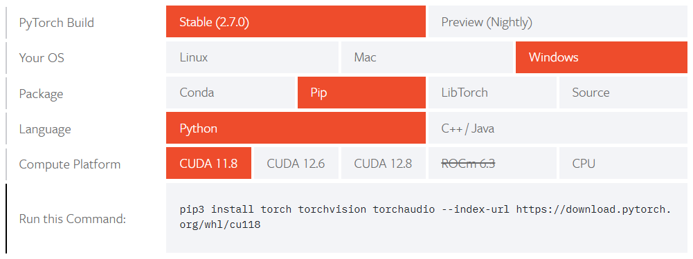

# Deep Learning skin diseases recognition

Deep learning skin diseases recognition system using CNN (Convolutional Neural Network) and ResNet (Residual Neural Network).

## Authors
- [@Florian IRRIEN](https://github.com/irrif)

## Installation 
To run this project on your device :

1. Clone this repository on your local machine : `git clone https://github.com/irrif/Computer_vision_skin_disease_classification.git`

2. Navigate to project directory : `cd Computer_vision_skin_disease_classification`

3. Create a virtual environment with  `conda env create -n cv_skin_disease --file environment.yaml`

4. Then goes to : https://pytorch.org/get-started/locally/ and select according to your machine and run the command.

5. Activate your conda environment with `conda activate cv_skin_disease`
